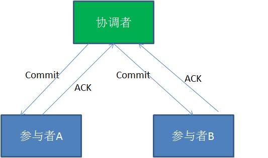
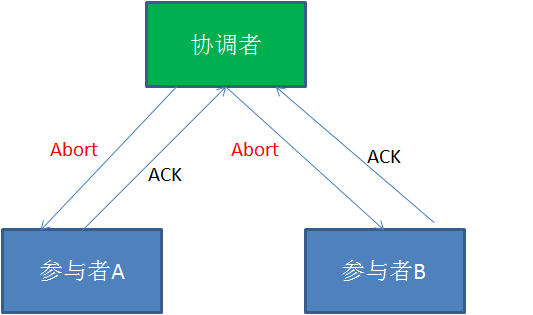

##  分布式事务
### 在XA协议中包含着两个角色：事务协调者和事务参与者
####  第一阶段：

####  在XA分布式事务的第一阶段，作为事务协调者的节点会首先向所有的参与者节点发送Prepare请求。在接到Prepare请求之后，每一个参与者节点会各自执行与事务有关的数据更新，写入Undo Log和Redo Log。如果参与者执行成功，暂时不提交事务，而是向事务协调节点返回“完成”消息。
####  当事务协调者接到了所有参与者的返回消息，整个分布式事务将会进入第二阶段。
####  第二阶段:

####  在XA分布式事务的第二阶段，如果事务协调节点在之前所收到都是正向返回，那么它将会向所有事务参与者发出Commit请求。接到Commit请求之后，事务参与者节点会各自进行本地的事务提交，并释放锁资源。当本地事务完成提交后，将会向事务协调者返回“完成”消息。当事务协调者接收到所有事务参与者的“完成”反馈，整个分布式事务完成。
####  以上所描述的是XA两阶段提交的正向流程，接下来我们看一看失败情况的处理流程：
####  第一阶段：

####  第二阶段:

####  在XA的第一阶段，如果某个事务参与者反馈失败消息，说明该节点的本地事务执行不成功，必须回滚。于是在第二阶段，事务协调节点向所有的事务参与者发送Abort请求。接收到Abort请求之后，各个事务参与者节点需要在本地进行事务的回滚操作，回滚操作依照Undo Log来进行。
### XA两阶段提交的不足
### 1.性能问题
####  XA协议遵循强一致性。在事务执行过程中，各个节点占用着数据库资源，只有当所有节点准备完毕，事务协调者才会通知提交，参与者提交后释放资源。这样的过程有着非常明显的性能问题。
### 2.协调者单点故障问题
####  事务协调者是整个XA模型的核心，一旦事务协调者节点挂掉，参与者收不到提交或是回滚通知，参与者会一直处于中间状态无法完成事务。
### 3.丢失消息导致的不一致问题。
####  在XA协议的第二个阶段，如果发生局部网络问题，一部分事务参与者收到了提交消息，另一部分事务参与者没收到提交消息，那么就导致了节点之间数据的不一致。
### 如果避免XA两阶段提交的种种问题呢？有许多其他的分布式事务方案可供选择：
### 1.XA三阶段提交
####  XA三阶段提交在两阶段提交的基础上增加了CanCommit阶段，并且引入了超时机制。一旦事物参与者迟迟没有接到协调者的commit请求，会自动进行本地commit。这样有效解决了协调者单点故障的问题。但是性能问题和不一致的问题仍然没有根本解决。
### 2.MQ事务
####  利用消息中间件来异步完成事务的后一半更新，实现系统的最终一致性。这个方式避免了像XA协议那样的性能问题。
### 3.TCC事务
####  TCC事务是Try、Commit、Cancel三种指令的缩写，其逻辑模式类似于XA两阶段提交，但是实现方式是在代码层面来人为实现。
### 在MySQL内部，在事务提交时利用两阶段提交（内部XA的两阶段提交）解决了bin log和redo log的一致性问题。
####  第一阶段：InnoDB Prepare阶段。此时SQL已经成功执行，并生成事务ID(xid)信息及redo和undo的内存日志。此阶段InnoDB会写事务的redo log，但要注意的是，此时redo log只是记录了事务的所有操作日志，并没有记录提交（commit）日志，因此事务此时的状态为Prepare。此阶段对binlog不会有任何操作。
####  第二阶段：commit 阶段，这个阶段又分成两个步骤。
####  第一步写bin log（先调用write()将bin log内存日志数据写入文件系统缓存，再调用fsync()将bin log文件系统缓存日志数据永久写入磁盘）；
####  第二步完成事务的提交（commit），此时在redo log中记录此事务的提交日志（增加commit 标签）。
####  在第一阶段并没有记录完整的redo log（不包含事务的commit标签）。 在第二阶段记录完binlog后再写入redo log的commit 标签。 以第二阶段中bin log的写入与否作为事务是否成功提交的标志。
### 崩溃恢复过程
####  如果数据库在记录此事务的binlog之前和过程中发生crash。数据库在恢复后认为此事务并没有成功提交，则会回滚此事务的操作。与此同时，因为在binlog中也没有此事务的记录，所以从库也不会有此事务的数据修改。如果数据库在记录此事务的binlog之后发生crash。此时，即使是redo log中还没有记录此事务的commit 标签，数据库在恢复后也会认为此事务提交成功（因为在上述两阶段过程中，binlog写入成功就认为事务成功提交了）。它会扫描最后一个binlog文件，并提取其中的事务ID（xid），InnoDB会将那些状态为Prepare的事务（redo log没有记录commit 标签）的xid和bin log中提取的xid做比较，如果在binlog中存在，则提交该事务，否则回滚该事务。这也就是说，bin log中记录的事务，在恢复时都会被认为是已提交事务，会在redo log中重新写入commit标志，并完成此事务的重做（主库中有此事务的数据修改）。与此同时，因为在binlog中已经有了此事务的记录，所有从库也会有此事务的数据修改。