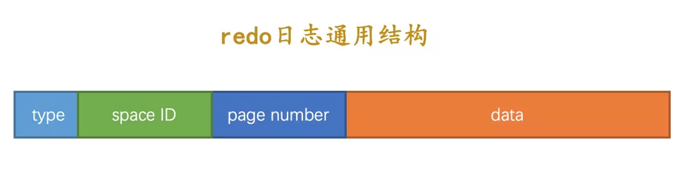
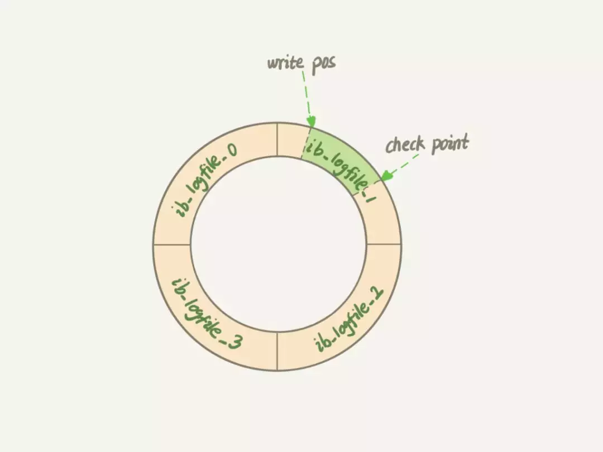
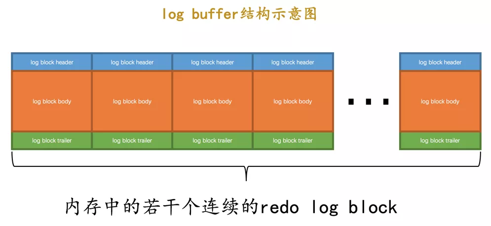

##  MySQL持久化保障机制-redo日志
redo日志是用来保证MySQL持久化功能的，需要注意的是redo日志是InnoDB引擎特有的功能。
为什么InnoDB引擎会引入redo日志作为中间层来保证MySQL持久化，而不是直接持久化到磁盘？我们先来看看一个故事。

在《孔乙己》这篇文章，酒店掌柜有一个粉板，专门用来记录客人的赊账记录。如果赊账的人不多，那么他可以把顾客名和账目写在板上。但如果赊账的人多了，粉板总会有记不下的时候，这个时候掌柜一定还有一个专门记录赊账的账本。

如果有人要赊账或者还账的话，掌柜一般有两种做法：

####  1、一种做法是直接把账本翻出来，把这次赊的账加上去或者扣除掉；
####  2、另一种做法是先在粉板上记下这次的账，等打烊以后再把账本翻出来核算。
在生意红火柜台很忙时，掌柜一定会选择后者，因为前者操作实在是太麻烦了。首先，你得找到这个人的赊账总额那条记录。你想想，密密麻麻几十页，掌柜要找到那个名字，可能还得带上老花镜慢慢找，找到之后再拿出算盘计算，最后再将结果写回到账本上。
这整个过程想想都麻烦。相比之下，还是先在粉板上记一下方便。你想想，如果掌柜没有粉板的帮助，每次记账都得翻账本，效率是不是低得让人难以忍受？

####  同样，在 MySQL 里也有这个问题，磁盘就相对于账本，如果每一次的更新操作都需要写进磁盘，然后磁盘也要找到对应的那条记录，然后再更新，整个过程 IO 成本、查找成本都很高。

为了解决这个问题，MySQL的设计者就用了类似酒店掌柜粉板的思路来提升更新效率，redo日志跟酒店粉板一样，用来临时存储，承担一个中转的角色。

具体来说，当有一条记录需要更新的时候，InnoDB 引擎就会先把记录写到redo log（粉板）里面，并更新内存，这个时候更新就算完成了。同时，InnoDB 引擎会在适当的时候，将这个操作记录更新到磁盘里面，而这个更新往往是在系统比较空闲的时候做，这就像打烊以后掌柜做的事。

通过上面的这个故事你可以理解为什么需要引入redo日志，对redo日志有一定的了解，下面我们就来正式介绍redo日志，先从redo日志的结构开始：

上面是redo日志的通用结构，redo日志记录的是每个页面（page）更改物理情况，所以redo日志整体来说是比较小的，存储的信息不多，简单的介绍一下这几个字段的意思：
####  type：该条redo日志的类型。
####  space ID：表空间ID。
####  page number：页号。
####  data：该条redo日志的具体内容。
redo 日志并非这么简单，它非常的复杂，但是我们不需要对它庖丁解牛，因为它确实对我们来说没啥用，我们只要记住 redo 日志会把事务在执行过程中对数据库所做的所有修改都记录下来，在之后系统崩溃重启后可以把事务所做的任何修改都恢复出来。

在事务提交时将所有修改过的内存中的页面刷新到磁盘中相比，只将该事务执行过程中产生的redo日志刷新到磁盘的好处如下：
####  redo日志占用的空间非常小：存储表空间ID、页号、偏移量以及需要更新的值所需的存储空间是很小的
####  redo日志是顺序写入磁盘的：在执行事务的过程中，每执行一条语句，就可能产生若干条redo日志，这些日志是按照产生的顺序写入磁盘的，也就是使用顺序IO。
### redo 日志工作原理
redo日志是循环写入的，因此InnoDB的redo log是固定大小的，比如可以配置为一组4个文件，每个文件的大小是1GB，那么这块“粉板”总共就可以记录 4GB 的操作。从头开始写，写到末尾就又回到开头循环写，如下面这个图所示：

write pos是当前记录的位置，一边写一边后移，写到第3号文件末尾后就回到0号文件开头。checkpoint是当前要擦除的位置，也是往后推移并且循环的，擦除记录前要把记录更新到数据文件。

write pos和checkpoint之间的是“粉板”上还空着的部分，可以用来记录新的操作。如果 write pos 追上 checkpoint，表示“粉板”满了，这时候不能再执行新的更新，得停下来先擦掉一些记录，把 checkpoint 推进一下。

这大概就是 redo 日志的工作原理，你就把它想象成一块黑板就好了。
### redo日志缓冲区
redo日志并不是直接写入磁盘的，而是先写入到缓存区，我们把这个缓冲区叫做redo日志缓冲区。在服务器启动时就向操作系统申请了一大片称之为redo log buffer的连续内存空间，我们也可以简称为log buffer。这片内存空间被划分成若干个连续的 redo log block，如下图所示：

在MySQL Server 5.7下redo日志缓冲区的大小默认为 1M，我们可以通过innodb_log_buffer_size参数来设置redo日志缓冲区的大小。

向log buffer中写入redo日志的过程是顺序的，也就是先往前边的block中写，当该block的空闲空间用完之后再往下一个block中写。

先写入缓冲区再写磁盘，就会碰到一个问题，这个问题在 redis AOF 持久化方式时也遇到过，就是缓冲区和磁盘之间的数据如何同步？

在 MySQL 的配置文件中提供了 innodb_flush_log_at_trx_commit 参数，这个可以用来控制缓冲区和磁盘之间的数据如何同步，这里有 0、1、2 三个选项，在我装的 MySQL 下默认的是 1，简单介绍一下这三个选项的区别：
####  0：表示当提交事务时，并不将缓冲区的redo日志写入磁盘的日志文件，而是等待主线程每秒刷新。
####  1：在事务提交时将缓冲区的redo日志同步写入到磁盘，保证一定会写入成功。
####  2：在事务提交时将缓冲区的redo日志异步写入到磁盘，即不能完全保证commit时肯定会写入redo日志文件，只是有这个动作。
我们使用默认值1就好，这样可以保证MySQL异常重启之后数据不丢失。

总结一下redo日志是InnoDB引擎特有的，有了redo日志之后，InnoDB就可以保证即使数据库发生异常重启，之前提交的记录都不会丢失。

