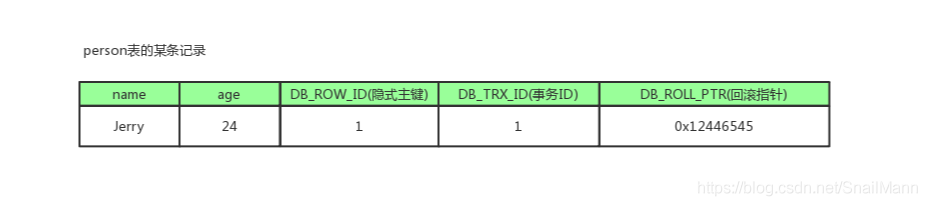
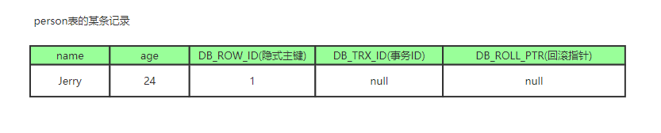
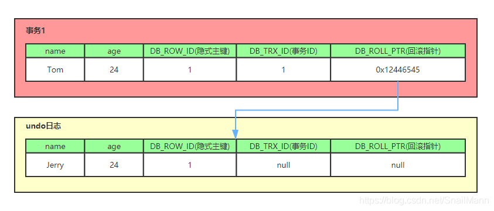
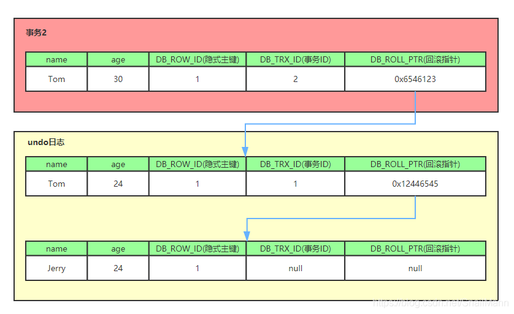
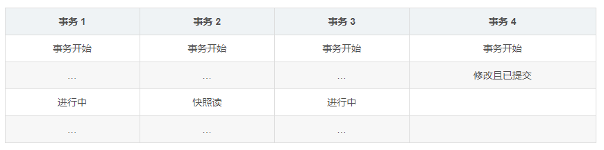
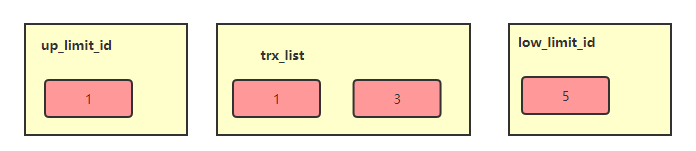
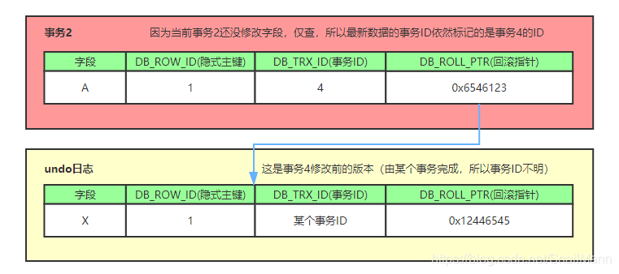
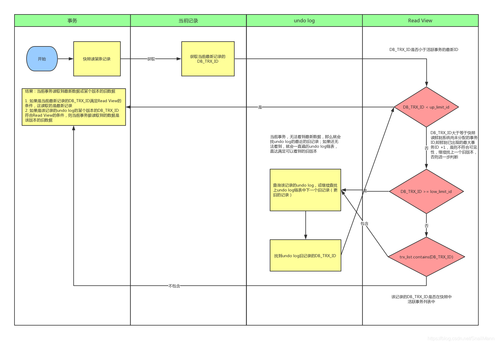
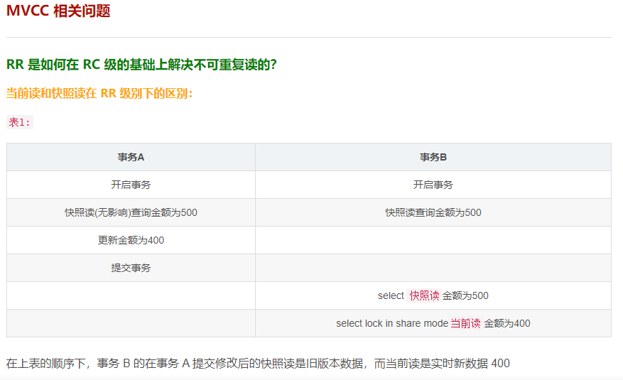
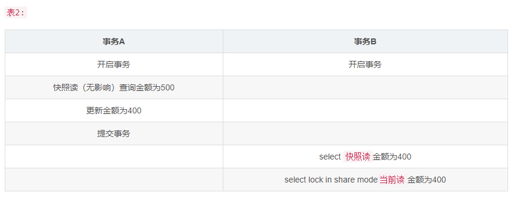

##  MVCC 的实现原理
MVCC 的目的就是多版本并发控制，在数据库中的实现，就是为了解决读写冲突，它的实现原理主要是依赖记录中的 3个隐式字段，undo日志 ，Read View 来实现的。所以我们先来看看这个三个 point 的概念

### 隐式字段
每行记录除了我们自定义的字段外，还有数据库隐式定义的 DB_TRX_ID, DB_ROLL_PTR, DB_ROW_ID 等字段

####  DB_TRX_ID
6 byte，最近修改(修改/插入)事务 ID：记录创建这条记录/最后一次修改该记录的事务 ID
####  DB_ROLL_PTR
7 byte，回滚指针，指向这条记录的上一个版本（存储于 rollback segment 里）
####  DB_ROW_ID
6 byte，隐含的自增 ID（隐藏主键），如果数据表没有主键，InnoDB 会自动以DB_ROW_ID产生一个聚簇索引
####  实际还有一个删除 flag 隐藏字段, 既记录被更新或删除并不代表真的删除，而是删除 flag 变了

####  如上图，DB_ROW_ID 是数据库默认为该行记录生成的唯一隐式主键，DB_TRX_ID 是当前操作该记录的事务 ID ,而 DB_ROLL_PTR 是一个回滚指针，用于配合 undo日志，指向上一个旧版本
### undo日志
####  undo log 主要分为两种：
####  insert undo log
代表事务在 insert 新记录时产生的 undo log, 只在事务回滚时需要，并且在事务提交后可以被立即丢弃
####  update undo log
事务在进行 update 或 delete 时产生的 undo log ; 不仅在事务回滚时需要，在快照读时也需要；所以不能随便删除，只有在快速读或事务回滚不涉及该日志时，对应的日志才会被 purge 线程统一清除
### 对 MVCC 有帮助的实质是 update undo log ，undo log 实际上就是存在 rollback segment 中旧记录链，它的执行流程如下：
####  一、 比如一个有个事务插入 persion 表插入了一条新记录，记录如下，name 为 Jerry , age 为 24 岁，隐式主键是 1，事务 ID和回滚指针，我们假设为 NULL

####  二、 现在来了一个事务 1对该记录的 name 做出了修改，改为 Tom
####  1、在事务 1修改该行(记录)数据时，数据库会先对该行加排他锁
####  2、然后把该行数据拷贝到 undo log 中，作为旧记录，既在 undo log 中有当前行的拷贝副本
####  3、拷贝完毕后，修改该行name为Tom，并且修改隐藏字段的事务 ID 为当前事务 1的 ID, 我们默认从 1 开始，之后递增，回滚指针指向拷贝到 undo log 的副本记录，既表示我的上一个版本就是它
####  4、事务提交后，释放锁

####  三、 又来了个事务 2修改person 表的同一个记录，将age修改为 30 岁
####  1、在事务2修改该行数据时，数据库也先为该行加锁
####  2、然后把该行数据拷贝到 undo log 中，作为旧记录，发现该行记录已经有 undo log 了，那么最新的旧数据作为链表的表头，插在该行记录的 undo log 最前面
####  3、修改该行 age 为 30 岁，并且修改隐藏字段的事务 ID 为当前事务 2的 ID, 那就是 2 ，回滚指针指向刚刚拷贝到 undo log 的副本记录
####  4、事务提交，释放锁

####  从上面，我们就可以看出，不同事务或者相同事务的对同一记录的修改，会导致该记录的undo log成为一条记录版本线性表，既链表，undo log 的链首就是最新的旧记录，链尾就是最早的旧记录（当然就像之前说的该 undo log 的节点可能是会 purge 线程清除掉，向图中的第一条 insert undo log，其实在事务提交之后可能就被删除丢失了，不过这里为了演示，所以还放在这里）
### Read View 读视图
####  什么是 Read View?
什么是 Read View，说白了 Read View 就是事务进行快照读操作的时候生产的读视图 (Read View)，在该事务执行的快照读的那一刻，会生成数据库系统当前的一个快照，记录并维护系统当前活跃事务的 ID (当每个事务开启时，都会被分配一个 ID , 这个 ID 是递增的，所以最新的事务，ID 值越大)
所以我们知道 Read View 主要是用来做可见性判断的, 即当我们某个事务执行快照读的时候，对该记录创建一个 Read View 读视图，把它比作条件用来判断当前事务能够看到哪个版本的数据，既可能是当前最新的数据，也有可能是该行记录的undo log里面的某个版本的数据。
####  Read View遵循一个可见性算法，主要是将要被修改的数据的最新记录中的 DB_TRX_ID（即当前事务 ID ）取出来，与系统当前其他活跃事务的 ID 去对比（由 Read View 维护），如果 DB_TRX_ID 跟 Read View 的属性做了某些比较，不符合可见性，那就通过 DB_ROLL_PTR 回滚指针去取出 Undo Log 中的 DB_TRX_ID 再比较，即遍历链表的 DB_TRX_ID（从链首到链尾，即从最近的一次修改查起），直到找到满足特定条件的 DB_TRX_ID , 那么这个 DB_TRX_ID 所在的旧记录就是当前事务能看见的最新老版本
####  在展示之前，我先简化一下 Read View，我们可以把 Read View 简单的理解成有三个全局属性
####  trx_list（名称我随意取的）
一个数值列表
用于维护 Read View 生成时刻系统 正活跃的事务 ID 列表
####  up_limit_id
lower water remark
是 trx_list 列表中事务 ID 最小的 ID
####  low_limit_id
hight water mark
ReadView 生成时刻系统尚未分配的下一个事务 ID ，也就是 目前已出现过的事务 ID 的最大值 + 1
为什么是 low_limit ? 因为它也是系统此刻可分配的事务 ID 的最小值
####  1、首先比较 DB_TRX_ID < up_limit_id , 如果小于，则当前事务能看到 DB_TRX_ID 所在的记录，如果大于等于进入下一个判断
####  2、接下来判断 DB_TRX_ID >= low_limit_id , 如果大于等于则代表 DB_TRX_ID 所在的记录在 Read View 生成后才出现的，那对当前事务肯定不可见，如果小于则进入下一个判断
####  3、判断 DB_TRX_ID 是否在活跃事务之中，trx_list.contains (DB_TRX_ID)，如果在，则代表我 Read View 生成时刻，你这个事务还在活跃，还没有 Commit，你修改的数据，我当前事务也是看不见的；如果不在，则说明，你这个事务在 Read View 生成之前就已经 Commit 了，你修改的结果，我当前事务是能看见的
### 整体流程
#####我们在了解了 隐式字段，undo log， 以及 Read View 的概念之后，就可以来看看 MVCC 实现的整体流程是怎么样了
####  整体的流程是怎么样的呢？我们可以模拟一下
####  一、当事务 2对某行数据执行了快照读，数据库为该行数据生成一个Read View读视图，假设当前事务 ID 为 2，此时还有事务1和事务3在活跃中，事务 4在事务 2快照读前一刻提交更新了，所以 Read View 记录了系统当前活跃事务 1，3 的 ID，维护在一个列表上，假设我们称为trx_list

####  二、Read View 不仅仅会通过一个列表 trx_list 来维护事务 2执行快照读那刻系统正活跃的事务 ID 列表，还会有两个属性 up_limit_id（ trx_list 列表中事务 ID 最小的 ID ），low_limit_id ( 快照读时刻系统尚未分配的下一个事务 ID ，也就是目前已出现过的事务ID的最大值 + 1 资料传送门 | 呵呵一笑百媚生的回答 ) 。所以在这里例子中 up_limit_id 就是1，low_limit_id 就是 4 + 1 = 5，trx_list 集合的值是 1, 3，Read View 如下图

####  三、我们的例子中，只有事务 4 修改过该行记录，并在事务 2 执行快照读前，就提交了事务，所以当前该行当前数据的 undo log 如下图所示；我们的事务 2 在快照读该行记录的时候，就会拿该行记录的 DB_TRX_ID 去跟 up_limit_id , low_limit_id 和活跃事务 ID 列表( trx_list )进行比较，判断当前事务 2能看到该记录的版本是哪个。

####  四、所以先拿该记录 DB_TRX_ID 字段记录的事务 ID 4 去跟 Read View 的 up_limit_id 比较，看 4 是否小于 up_limit_id( 1 )，所以不符合条件，继续判断 4 是否大于等于 low_limit_id( 5 )，也不符合条件，最后判断 4 是否处于 trx_list 中的活跃事务, 最后发现事务 ID 为 4 的事务不在当前活跃事务列表中, 符合可见性条件，所以事务 4修改后提交的最新结果对事务 2 快照读时是可见的，所以事务 2 能读到的最新数据记录是事务4所提交的版本，而事务4提交的版本也是全局角度上最新的版本

####  也正是 Read View 生成时机的不同，从而造成 RC , RR 级别下快照读的结果的不同

####  而在表 2这里的顺序中，事务 B 在事务 A 提交后的快照读和当前读都是实时的新数据 400，这是为什么呢？
这里与上表的唯一区别仅仅是表 1的事务 B 在事务 A 修改金额前快照读过一次金额数据，而表 2的事务B在事务A修改金额前没有进行过快照读。
所以我们知道事务中快照读的结果是非常依赖该事务首次出现快照读的地方，即某个事务中首次出现快照读的地方非常关键，它有决定该事务后续快照读结果的能力
我们这里测试的是更新，同时删除和更新也是一样的，如果事务B的快照读是在事务A操作之后进行的，事务B的快照读也是能读取到最新的数据的
####  RC , RR 级别下的 InnoDB 快照读有什么不同？
正是 Read View 生成时机的不同，从而造成 RC , RR 级别下快照读的结果的不同
在 RR 级别下的某个事务的对某条记录的第一次快照读会创建一个快照及 Read View, 将当前系统活跃的其他事务记录起来，此后在调用快照读的时候，还是使用的是同一个 Read View，所以只要当前事务在其他事务提交更新之前使用过快照读，那么之后的快照读使用的都是同一个 Read View，所以对之后的修改不可见；
即 RR 级别下，快照读生成 Read View 时，Read View 会记录此时所有其他活动事务的快照，这些事务的修改对于当前事务都是不可见的。而早于Read View创建的事务所做的修改均是可见
而在 RC 级别下的，事务中，每次快照读都会新生成一个快照和 Read View , 这就是我们在 RC 级别下的事务中可以看到别的事务提交的更新的原因
总之在 RC 隔离级别下，是每个快照读都会生成并获取最新的 Read View；而在 RR 隔离级别下，则是同一个事务中的第一个快照读才会创建 Read View, 之后的快照读获取的都是同一个 Read View。
