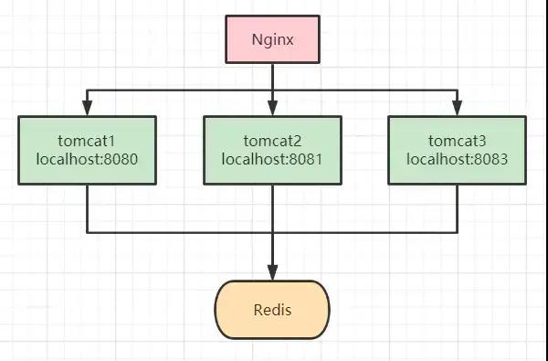
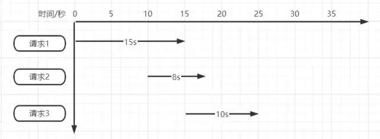
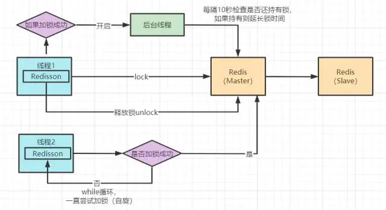

##  分布式锁（Redisson）-从零开始，深入理解与不断优化

分布式锁的使用场景：

1、互联网秒杀 2、抢优惠卷 3、接口幂等性校验

如下代码模拟了下单减库存的场景，我们分析下在高并发场景下会存在什么问题
```java
package com.wangcp.redisson;

import org.springframework.beans.factory.annotation.Autowired;
import org.springframework.data.redis.core.StringRedisTemplate;
import org.springframework.web.bind.annotation.RequestMapping;
import org.springframework.web.bind.annotation.RestController;

@RestController
public class IndexController {

    @Autowired
    private StringRedisTemplate stringRedisTemplate;

    /**
     * 模拟下单减库存的场景
     * @return
     */
    @RequestMapping(value = "/duduct_stock")
    public String deductStock(){
        // 从redis 中拿当前库存的值
        int stock = Integer.parseInt(stringRedisTemplate.opsForValue().get("stock"));
        if(stock > 0){
            int realStock = stock - 1;
            stringRedisTemplate.opsForValue().set("stock",realStock + "");
            System.out.println("扣减成功，剩余库存：" + realStock);
        }else{
            System.out.println("扣减失败，库存不足");
        }
        return "end";
    }
}
```
假设在redis中库存（stock）初始值是100。

现在有5个客户端同时请求该接口，可能就会存在同时执行
```java
int stock = Integer.parseInt(stringRedisTemplate.opsForValue().get("stock"));
```
### 案例2-使用synchronized 实现单机锁

在遇到案例1的问题后，大部分人的第一反应都会想到加锁来控制事务的原子性，如下代码所示：
```java
@RequestMapping(value = "/duduct_stock")
public String deductStock(){
    synchronized (this){
        // 从redis 中拿当前库存的值
        int stock = Integer.parseInt(stringRedisTemplate.opsForValue().get("stock"));
        if(stock > 0){
            int realStock = stock - 1;
            stringRedisTemplate.opsForValue().set("stock",realStock + "");
            System.out.println("扣减成功，剩余库存：" + realStock);
        }else{
            System.out.println("扣减失败，库存不足");
        }
    }
    return "end";
}
```
现在当有多个请求访问该接口时，同一时刻只有一个请求可进入方法体中进行库存的扣减，其余请求等候。

但我们都知道，synchronized 锁是属于JVM级别的，也就是我们俗称的“单机锁”。但现在基本大部分公司使用的都是集群部署，现在我们思考下以上代码在集群部署的情况下还能保证库存数据的一致性吗？



答案是不能，如上图所示，请求经Nginx分发后，可能存在多个服务同时从Redis中获取库存数据，此时只加synchronized （单机锁）是无效的，并发越高，出现问题的几率就越大。

### 案例3-使用SETNX实现分布式锁

setnx：将 key 的值设为 value，当且仅当 key 不存在。 若给定 key 已经存在，则 setnx 不做任何动作。

使用setnx实现简单的分布式锁：
```java
/**
 * 模拟下单减库存的场景
 * @return
 */
@RequestMapping(value = "/duduct_stock")
public String deductStock(){
    String lockKey = "product_001";
    // 使用 setnx 添加分布式锁
    // 返回 true 代表之前redis中没有key为 lockKey 的值，并已进行成功设置
    // 返回 false 代表之前redis中已经存在 lockKey 这个key了
    Boolean result = stringRedisTemplate.opsForValue().setIfAbsent(lockKey, "wangcp");
    if(!result){
        // 代表已经加锁了
        return "error_code";
    }

    // 从redis 中拿当前库存的值
    int stock = Integer.parseInt(stringRedisTemplate.opsForValue().get("stock"));
    if(stock > 0){
        int realStock = stock - 1;
        stringRedisTemplate.opsForValue().set("stock",realStock + "");
        System.out.println("扣减成功，剩余库存：" + realStock);
    }else{
        System.out.println("扣减失败，库存不足");
    }

    // 释放锁
    stringRedisTemplate.delete(lockKey);
    return "end";
}
```
我们知道 Redis 是单线程执行，现在再看案例2中的流程图时，哪怕高并发场景下多个请求都执行到了setnx的代码，redis会根据请求的先后顺序进行排列，只有排列在队头的请求才能设置成功。其它请求只能返回“error_code”。

当setnx设置成功后，可执行业务代码对库存扣减，执行完成后对锁进行释放。

我们再来思考下以上代码已经完美实现分布式锁了吗？能够支撑高并发场景吗？答案并不是，上面的代码还是存在很多问题的，离真正的分布式锁还差的很远。我们分析下以上代码存在的问题：

死锁：假如第一个请求在setnx加锁完成后，执行业务代码时出现了异常，那释放锁的代码就无法执行，后面所有的请求也都无法进行操作了。

针对死锁的问题，我们对代码再次进行优化，添加try-finally，在finally中添加释放锁代码，这样无论如何都会执行释放锁代码，如下所示：
```java
/**
     * 模拟下单减库存的场景
     * @return
     */
@RequestMapping(value = "/duduct_stock")
public String deductStock(){
    String lockKey = "product_001";

    try{
        // 使用 setnx 添加分布式锁
        // 返回 true 代表之前redis中没有key为 lockKey 的值，并已进行成功设置
        // 返回 false 代表之前redis中已经存在 lockKey 这个key了
        Boolean result = stringRedisTemplate.opsForValue().setIfAbsent(lockKey, "wangcp");
        if(!result){
            // 代表已经加锁了
            return "error_code";
        }
        // 从redis 中拿当前库存的值
        int stock = Integer.parseInt(stringRedisTemplate.opsForValue().get("stock"));
        if(stock > 0){
            int realStock = stock - 1;
            stringRedisTemplate.opsForValue().set("stock",realStock + "");
            System.out.println("扣减成功，剩余库存：" + realStock);
        }else{
            System.out.println("扣减失败，库存不足");
        }
    }finally {
        // 释放锁
        stringRedisTemplate.delete(lockKey);
    }

    return "end";
}
```
经过改进后的代码是否还存在问题呢？我们思考正常执行的情况下应该是没有问题，但我们假设请求在执行到业务代码时服务突然宕机了，或者正巧你的运维同事重新发版，粗暴的 kill -9 掉了呢，那代码还能执行 finally 吗？
### 案例4-加入过期时间
针对想到的问题，对代码再次进行优化，加入过期时间，这样即便出现了上述的问题，在时间到期后锁也会自动释放掉，不会出现“死锁”的情况。
```java
@RequestMapping(value = "/duduct_stock")
public String deductStock(){
    String lockKey = "product_001";

    try{
        Boolean result = stringRedisTemplate.opsForValue().setIfAbsent(lockKey,"wangcp",10,TimeUnit.SECONDS);
        if(!result){
            // 代表已经加锁了
            return "error_code";
        }
        // 从redis 中拿当前库存的值
        int stock = Integer.parseInt(stringRedisTemplate.opsForValue().get("stock"));
        if(stock > 0){
            int realStock = stock - 1;
            stringRedisTemplate.opsForValue().set("stock",realStock + "");
            System.out.println("扣减成功，剩余库存：" + realStock);
        }else{
            System.out.println("扣减失败，库存不足");
        }
    }finally {
        // 释放锁
        stringRedisTemplate.delete(lockKey);
    }

    return "end";
}
```
现在我们再思考一下，给锁加入过期时间后就可以了吗？就可以完美运行不出问题了吗？

超时时间设置的10s真的合适吗？如果不合适设置多少秒合适呢？如下图所示



假设同一时间有三个请求。

请求1首先加锁后需执行15秒，但在执行到10秒时锁失效释放。

请求2进入后加锁执行，在请求2执行到5秒时，请求1执行完成进行锁释放，但此时释放掉的是请求2的锁。

请求3在请求2执行5秒时开始执行，但在执行到3秒时请求2执行完成将请求3的锁进行释放。

我们现在只是模拟3个请求便可看出问题，如果在真正高并发的场景下，可能锁就会面临“一直失效”或“永久失效”。

那么具体问题出在哪里呢？总结为以下几点：

1.存在请求释放锁时释放掉的并不是自己的锁

2.超时时间过短，存在代码未执行完便自动释放

针对问题我们思考对应的解决方法：

针对问题1，我们想到在请求进入时生成一个唯一id，使用该唯一id作为锁的value值，释放时先进行获取比对，比对相同时再进行释放，这样就可以解决释放掉其它请求锁的问题。

针对问题2，我们思考不断的延长过期时间真的合适吗？设置短了存在超时自动释放的问题，设置长了又会出现宕机后一段时间锁无法释放的问题，虽然不会再出现“死锁”。针对这个问题，如何解决呢？

### 案例5-Redisson分布式锁
SpringBoot集成Redisson步骤

引入依赖
```java
<dependency>
    <groupId>org.redisson</groupId>
    <artifactId>redisson</artifactId>
    <version>3.6.5</version>
</dependency>
```
初始化客户端
```java
@Bean
public RedissonClient redisson(){
    // 单机模式
    Config config = new Config();
    config.useSingleServer().setAddress("redis://192.168.3.170:6379").setDatabase(0);
    return Redisson.create(config);
}
```
Redisson实现分布式锁

```java
package com.wangcp.redisson;

import org.redisson.api.RLock;
import org.redisson.api.RedissonClient;
import org.springframework.beans.factory.annotation.Autowired;
import org.springframework.data.redis.core.StringRedisTemplate;
import org.springframework.web.bind.annotation.RequestMapping;
import org.springframework.web.bind.annotation.RestController;

@RestController
public class IndexController {

    @Autowired
    private RedissonClient redisson;
    @Autowired
    private StringRedisTemplate stringRedisTemplate;

    /**
     * 模拟下单减库存的场景
     * @return
     */
    @RequestMapping(value = "/duduct_stock")
    public String deductStock(){
        String lockKey = "product_001";
        // 1.获取锁对象
        RLock redissonLock = redisson.getLock(lockKey);
        try{
            // 2.加锁
            redissonLock.lock();  // 等价于 setIfAbsent(lockKey,"wangcp",10,TimeUnit.SECONDS);
            // 从redis 中拿当前库存的值
            int stock = Integer.parseInt(stringRedisTemplate.opsForValue().get("stock"));
            if(stock > 0){
                int realStock = stock - 1;
                stringRedisTemplate.opsForValue().set("stock",realStock + "");
                System.out.println("扣减成功，剩余库存：" + realStock);
            }else{
                System.out.println("扣减失败，库存不足");
            }
        }finally {
            // 3.释放锁
            redissonLock.unlock();
        }
        return "end";
    }
}
```
Redisson 分布式锁实现原理图



Redisson 底层源码分析

我们点击 lock() 方法，查看源码，最终看到以下代码

```java
<T> RFuture<T> tryLockInnerAsync(long leaseTime, TimeUnit unit, long threadId, RedisStrictCommand<T> command) {
        internalLockLeaseTime = unit.toMillis(leaseTime);

        return commandExecutor.evalWriteAsync(getName(), LongCodec.INSTANCE, command,
                  "if (redis.call('exists', KEYS[1]) == 0) then " +
                      "redis.call('hset', KEYS[1], ARGV[2], 1); " +
                      "redis.call('pexpire', KEYS[1], ARGV[1]); " +
                      "return nil; " +
                  "end; " +
                  "if (redis.call('hexists', KEYS[1], ARGV[2]) == 1) then " +
                      "redis.call('hincrby', KEYS[1], ARGV[2], 1); " +
                      "redis.call('pexpire', KEYS[1], ARGV[1]); " +
                      "return nil; " +
                  "end; " +
                  "return redis.call('pttl', KEYS[1]);",
                    Collections.<Object>singletonList(getName()), internalLockLeaseTime, getLockName(threadId));
    }
```
没错，加锁最终执行的就是这段 lua 脚本语言。
```java
if (redis.call('exists', KEYS[1]) == 0) then 
    redis.call('hset', KEYS[1], ARGV[2], 1); 
    redis.call('pexpire', KEYS[1], ARGV[1]); 
    return nil; 
end;
```
脚本的主要逻辑为：

exists 判断 key 是否存在

当判断不存在则设置 key

然后给设置的key追加过期时间

这样来看其实和我们前面案例中的实现方法好像没什么区别，但实际上并不是。

这段lua脚本命令在Redis中执行时，会被当成一条命令来执行，能够保证原子性，故要不都成功，要不都失败。

我们在源码中看到Redssion的许多方法实现中很多都用到了lua脚本，这样能够极大的保证命令执行的原子性。

Redisson锁自动“续命”源码
```java
private void scheduleExpirationRenewal(final long threadId) {
    if (expirationRenewalMap.containsKey(getEntryName())) {
        return;
    }

    Timeout task = commandExecutor.getConnectionManager().newTimeout(new TimerTask() {
        @Override
        public void run(Timeout timeout) throws Exception {

            RFuture<Boolean> future = commandExecutor.evalWriteAsync(getName(), LongCodec.INSTANCE, RedisCommands.EVAL_BOOLEAN,
                                                                     "if (redis.call('hexists', KEYS[1], ARGV[2]) == 1) then " +
                                                                     "redis.call('pexpire', KEYS[1], ARGV[1]); " +
                                                                     "return 1; " +
                                                                     "end; " +
                                                                     "return 0;",
                                                                     Collections.<Object>singletonList(getName()), internalLockLeaseTime, getLockName(threadId));

            future.addListener(new FutureListener<Boolean>() {
                @Override
                public void operationComplete(Future<Boolean> future) throws Exception {
                    expirationRenewalMap.remove(getEntryName());
                    if (!future.isSuccess()) {
                        log.error("Can't update lock " + getName() + " expiration", future.cause());
                        return;
                    }

                    if (future.getNow()) {
                        // reschedule itself
                        scheduleExpirationRenewal(threadId);
                    }
                }
            });
        }
    }, internalLockLeaseTime / 3, TimeUnit.MILLISECONDS);

    if (expirationRenewalMap.putIfAbsent(getEntryName(), task) != null) {
        task.cancel();
    }
}
```
这段代码是在加锁后开启一个守护线程进行监听。Redisson超时时间默认设置30s，线程每10s调用一次判断锁还是否存在，如果存在则延长锁的超时时间。

现在，我们再回过头来看看案例5中的加锁代码与原理图，其实完善到这种程度已经可以满足很多公司的使用了，并且很多公司也确实是这样用的。但我们再思考下是否还存在问题呢？例如以下场景：

众所周知 Redis 在实际部署使用时都是集群部署的，那在高并发场景下我们加锁，当把key写入到master节点后，master还未同步到slave节点时master宕机了，原有的slave节点经过选举变为了新的master节点，此时可能就会出现锁失效问题。

通过分布式锁的实现机制我们知道，高并发场景下只有加锁成功的请求可以继续处理业务逻辑。那就出现了大伙都来加锁，但有且仅有一个加锁成功了，剩余的都在等待。其实分布式锁与高并发在语义上就是相违背的，我们的请求虽然都是并发，但Redis帮我们把请求进行了排队执行，也就是把我们的并行转为了串行。串行执行的代码肯定不存在并发问题了，但是程序的性能肯定也会因此受到影响。

针对这些问题，我们再次思考解决方案

在思考解决方案时我们首先想到CAP原则（一致性、可用性、分区容错性），那么现在的Redis就是满足AP(可用性、分区容错性)，如果想要解决该问题我们就需要寻找满足CP(一致性、分区容错性)的分布式系统。首先想到的就是zookeeper，zookeeper的集群间数据同步机制是当主节点接收数据后不会立即返回给客户端成功的反馈，它会先与子节点进行数据同步，半数以上的节点都完成同步后才会通知客户端接收成功。并且如果主节点宕机后，根据zookeeper的Zab协议（Zookeeper原子广播）重新选举的主节点一定是已经同步成功的。

那么问题来了，Redisson与zookeeper分布式锁我们如何选择呢？答案是如果并发量没有那么高，可以用zookeeper来做分布式锁，但是它的并发能力远远不如Redis。如果你对并发要求比较高的话，那就用Redis，偶尔出现的主从架构锁失效的问题其实是可以容忍的。

关于第二个提升性能的问题，我们可以参考ConcurrentHashMap的锁分段技术的思想，例如我们代码的库存量当前为1000，那我们可以分为10段，每段100，然后对每段分别加锁，这样就可以同时执行10个请求的加锁与处理，当然有要求的同学还可以继续细分。但其实Redis的Qps已经达到10W+了，没有特别高并发量的场景下也是完全够用的。


