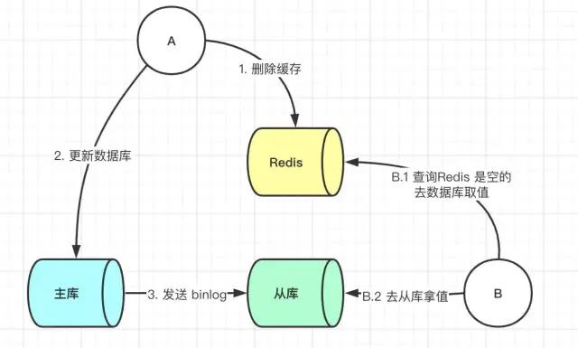

##Redis缓存和Mysql数据库双写一致性？
###四种更新策略
####1、先更新数据库，后更新缓存
####2、先更新缓存，后更新数据库
####*其中方式1、2存在明显的问题。有些业务中缓存中存在的值并不是直接从数据库中查出来的，有的是需要经过一系列计算来的缓存值，那么这时候后你要更新缓存的话其实代价是很高的。如果此时有大量的对数据库进行写数据的请求，但是读请求并不多，那么此时如果每次写请求都更新一下缓存，那么性能损耗是非常大的。
####3、先删除缓存，后更新数据库
####该方式也会存在问题：

####此时来了两个请求，请求 A（更新操作） 和请求 B（查询操作）
####1、请求A会先删除Redis中的数据，然后去数据库进行更新操作，
####2、此时请求B看到Redis中的数据时空的，会去数据库中查询该值，补录到Redis中，
####3、但是此时请求A并没有更新成功，或者事务还未提交，那么这时候就会产生数据库和Redis数据不一致的问题。
####如何解决呢？其实最简单的解决办法就是延时双删的策略。

####但是上述的保证事务提交完以后再进行删除缓存还有一个问题，就是如果你使用的是Mysql的读写分离的架构的话，那么其实主从同步之间也会有时间差。

####此时来了两个请求，请求 A（更新操作） 和请求 B（查询操作）
####1、请求 A 更新操作，删除了 Redis
####2、请求主库进行更新操作，主库与从库进行同步数据的操作
####3、请 B 查询操作，发现 Redis 中没有数据
####4、去从库中拿去数据
####5、此时同步数据还未完成，拿到的数据是旧数据
####此时的解决办法就是如果是对 Redis 进行填充数据的查询数据库操作，那么就强制将其指向主库进行查询。

####4、先更新数据库，后删除缓存
####问题：这一种情况也会出现问题，比如更新数据库成功了，但是在删除缓存的阶段出错了没有删除成功，那么此时再读取缓存的时候每次都是错误的数据了。

####1、此时解决方案就是利用消息队列进行删除的补偿。具体的业务逻辑用语言描述如下：
####2、请求 A 先对数据库进行更新操作
####3、在对 Redis 进行删除操作的时候发现报错，删除失败
####4、此时将Redis 的 key 作为消息体发送到消息队列中
####5、系统接收到消息队列发送的消息后再次对 Redis 进行删除操作
####但是这个方案会有一个缺点就是会对业务代码造成大量的侵入，深深的耦合在一起，所以这时会有一个优化的方案，我们知道对 Mysql 数据库更新操作后再 binlog 日志中我们都能够找到相应的操作，那么我们可以订阅 Mysql 数据库的 binlog 日志对缓存进行操作。
