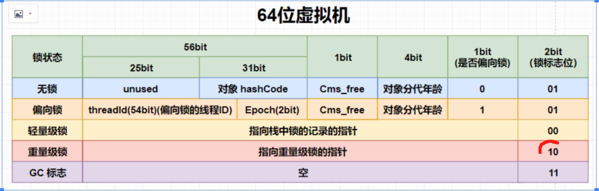
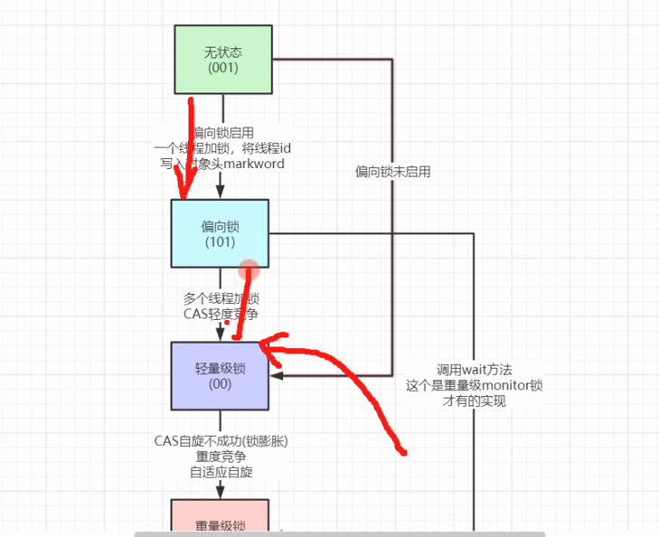
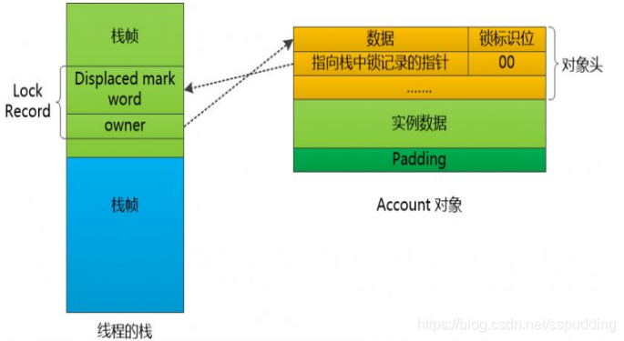
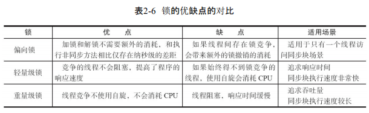

##  锁的升级过程
####  Java SE 1.6为了减少获得锁和释放锁带来的性能消耗，引入了“偏向锁”和“轻量级锁”，在Java SE 1.6中，锁一共有4种状态，级别从低到高依次是：无锁状态、偏向锁状态、轻量级锁状态和重量级锁状态，这几个状态会随着竞争情况逐渐升级。锁可以升级但不能降级，意味着偏向锁升级成轻量级锁后不能降级成偏向锁。这种锁升级却不能降级的策略，目的是为了提高获得锁和释放锁的效率。
####  synchronized用的锁是存在Java对象头里的。如果对象是数组类型，则虚拟机用3个字宽（Word）存储对象头，如果对象是非数组类型，则用2字宽存储对象头。
####  Mark Word 状态变化：

### 1、无锁：
### 2、偏向锁：

    大多数情况下，锁不仅不存在多线程竞争，而且总是由同一线程多次获得，为了让线程获得锁的代价更低而引入偏向锁。
    当一个线程访问同步代码块并获取锁时，会在对象头和栈帧中的锁记录里存储锁偏向的线程ID，
    以后该线程再进入和退出同步块时不需要进行CAS操作来加锁和解锁，只需要简单地测试一下对象头的Mark Word里是否存储着指向当前线程的偏向锁。
    如果测试成功，表示线程已经获得了锁。
    如果测试失败，则需要再测试一下Mark Word中偏向锁的标识是否设置为1（表示指向当前进程）：
    如果没有，则使用CAS竞争锁；如果设置了，则尝试使用CAS将对象头的偏向锁指向当前进程。
    这就是偏向锁，在没有别的线程竞争的时候，一直偏向当前线程，当前线程可以一直执行
### 3、轻量锁（自旋锁）：

    轻量级锁是由偏向所升级来的，偏向锁运行在一个线程进入同步块的情况下，当第二个线程加入锁争用的时候，偏向锁就会升级为轻量级锁
    轻量级锁的加锁过程：
    在代码进入同步块的时候，如果同步对象锁状态为无锁状态（锁标志位为“01”状态，是否为偏向锁为“0”），虚拟机首先将在当前线程的栈帧中建立一个名为锁记录（Lock Record）的空间，用于存储锁对象目前的Mark Word的拷贝，官方称之为 Displaced Mark Word。
    拷贝对象头中的Mark Word复制到锁记录中；
    拷贝成功后，虚拟机将使用CAS操作尝试将对象的Mark Word更新为指向Lock Record的指针，并将Lock record里的owner指针指向object mark word。如果更新成功，则执行步骤4，否则执行步骤5。
    如果这个更新动作成功了，那么这个线程就拥有了该对象的锁，并且对象Mark Word的锁标志位设置为“00”，即表示此对象处于轻量级锁定状态。
    如果这个更新操作失败了，虚拟机首先会检查对象的Mark Word是否指向当前线程的栈帧，如果是就说明当前线程已经拥有了这个对象的锁，那就可以直接进入同步块继续执行。否则说明多个线程竞争锁，轻量级锁就要膨胀为重量级锁，锁标志的状态值变为“10”，Mark Word中存储的就是指向重量级锁（互斥量）的指针，后面等待锁的线程也要进入阻塞状态。 而当前线程便尝试使用自旋来获取锁，自旋就是为了不让线程阻塞，而采用循环去获取锁的过程。

### 4、重量级锁：

    轻量级锁膨胀之后，就升级为重量级锁了。
    重量级锁是依赖对象内部的monitor锁来实现的，而monitor又依赖操作系统的MutexLock(互斥锁)来实现的，所以重量级锁也被成为互斥锁。
    synchronized就是一个典型的重量级锁 synchronized关键字
